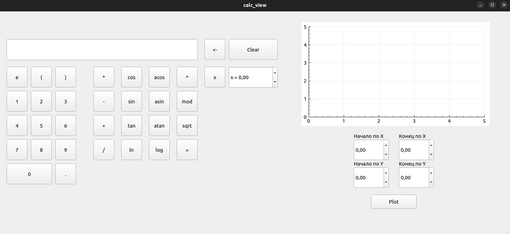
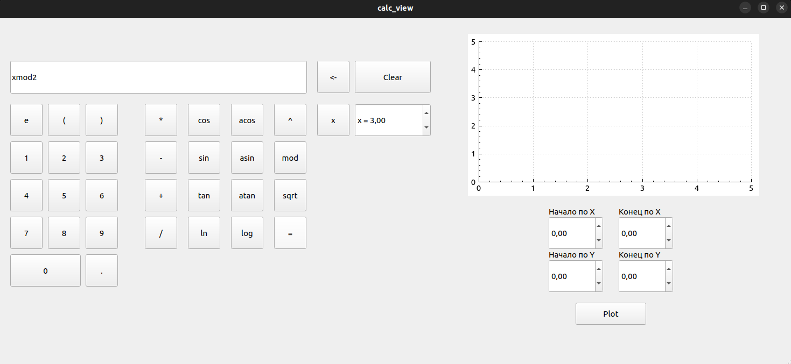
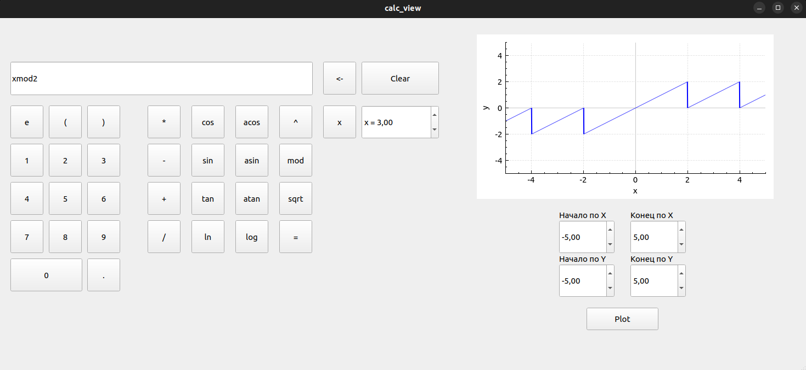
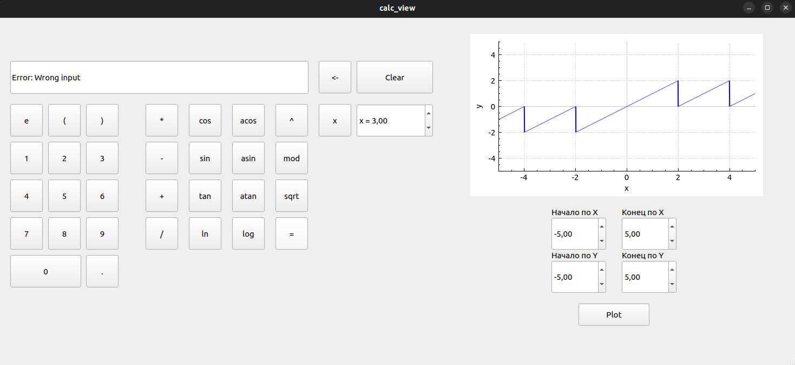

# SmartCalc v2.0 by bruscoaz <!-- omit in toc -->
Версия калькулятора на языке __C++__ с использованием __Qt(6.5.3)__.

## Information

В данном проекте реализован **каклькулятор**, который позволяет вычислять выражения в инфиксной записи, с помощью их перевода в польскую нотацию.

**Поддерживаемые операторы:**

| Название оператора   | Инфиксная нотация   (Классическая) | Префиксная нотация   (Польская нотация) | Постфиксная нотация   (Обратная польская нотация) |
| -------------------- | --------------------------------------- | -------------------------------------------- | ------------------------------------------------------ |
| Скобки               | (a + b)                                 | (+ a b)                                      | a b +                                                  |
| Сложение             | a + b                                   | + a b                                        | a b +                                                  |
| Вычитание            | a - b                                   | - a b                                        | a b -                                                  |
| Умножение            | a * b                                   | * a b                                        | a b *                                                  |
| Деление              | a / b                                   | / a b                                        | a b \                                                  |
| Возведение в степень | a ^ b                                   | ^ a b                                        | a b ^                                                  |
| Остаток от деления   | a mod b                                 | mod a b                                      | a b mod                                                |
| Унарный плюс         | +a                                      | +a                                           | a+                                                     |
| Унарный минус        | -a                                      | -a                                           | a-                                                     |

**Функции:**  

| Описание функции               | Функция |
| ------------------------------ | ------- |
| Вычисляет косинус              | cos(x)  |
| Вычисляет синус                | sin(x)  |
| Вычисляет тангенс              | tan(x)  |
| Вычисляет арккосинус           | acos(x) |
| Вычисляет арксинус             | asin(x) |
| Вычисляет арктангенс           | atan(x) |
| Вычисляет квадратный корень    | sqrt(x) |
| Вычисляет натуральный логарифм | ln(x)   |
| Вычисляет десятичный логарифм  | log(x)  |

Реализовано построение графика функции с помощью библиотеки __qcustomplot__.

## Installation
- Для установки вам необходимо перейти в дирректорию __src__ и в терминале выполнить команду `make install`. Приложение будет установленно в паку __build__;
- Чтобы удалить приложение - выполните команду `make uninstall`;
- Для формирования __tgz архива__  выполните команду `make dist`. Архив будет находиться в папке __dist__;
- Для просмотра документации выполните команду `make dvi`; 
- Для запуска тестов необходимо выполнить команду `make test`;
- Для просмотра покрытия кода выполните команду `make gcov_report`;

## Options
Основы работы с приложением:
- Чтобы ввести выражение для рассчета, выможете использовать два возможных варианта ввода:
  - Ввод с помощью нажатия соответсвующих кнопок;
  - Ввод с клавиатуры;
- Чтобы задать значение __x__, используйте соотвествующее поле(Spinbox), введите в нем нужное вам значение;
- Для вычисления результата нажмите на __=__. Результат вычислений отобразится на поле, куда вводились данные.
  - Если произошла __ошибка__ (деление на ноль, некорректный ввод) - её название и пояснение будет выведенно на поле ввода;
  - Если все прошло успешно, будет выведен числовой результат с точностью __7 знаков__ после запятой;
- Для построения графика необходимо:
  - Выбрать диапазон для осей __x__ и __y__ с помощью полей(Spinbox);
  - Ввести выражение для расчета;
  - Нажать на кнопку __Plot__;

## Examples
Калькулятор:

Ввод значений:

Вывод графика:

Ошибка вычисления:

Ошибка ввода:

